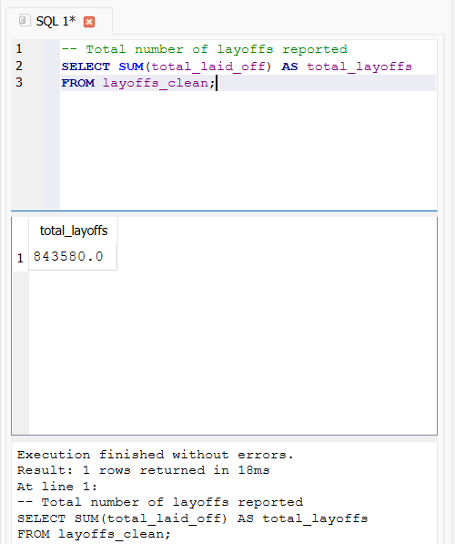
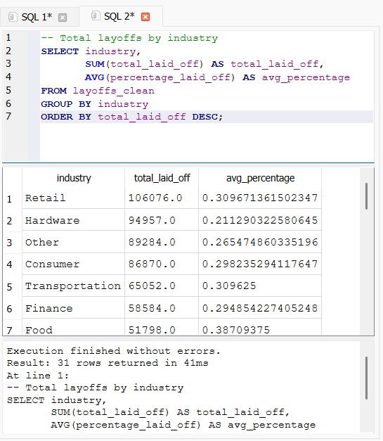
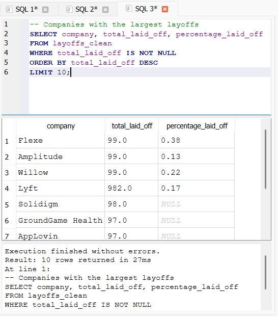
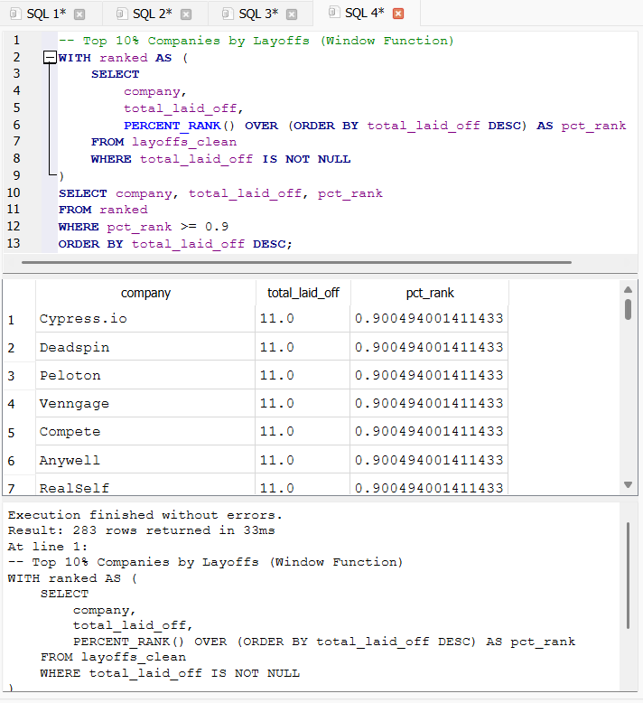

# SQL Data Exploration Project: Global Layoffs Analysis

## Overview
This project demonstrates a complete **SQL data exploration workflow** using **SQLite** and **DB Browser for SQLite**.

Using a real-world **global layoffs dataset**, the project focuses on:
- Data cleaning and preparation
- Exploratory Data Analysis (EDA)
- Generating business insights using SQL

The goal of this project is to showcase **practical SQL skills** in a structured and professional way suitable for a data analyst portfolio.

---

## Tools Used
- SQLite
- DB Browser for SQLite
- SQL (Structured Query Language)

---

## Data Cleaning

The raw dataset was cleaned using SQL by:
- Removing duplicates
- Trimming unnecessary whitespace
- Converting columns to appropriate data types
- Handling NULL values

A cleaned table (`layoffs_clean`) was created for analysis.

---

## Exploratory Data Analysis

The analysis was conducted using structured SQL queries, progressing from basic to more advanced queries.

---

## Key Insights

### 1. Total Layoffs Across All Companies

- Over **800,000 layoffs** were recorded globally
- Demonstrates large-scale workforce reductions across industries

---

### 2. Layoffs by Industry

- Consumer and Finance industries experienced the highest layoffs
- Indicates strong impact on customer-facing and financial sectors

---

### 3. Top 10 Companies by Layoffs

- A small number of companies contributed significantly to total layoffs
- Highlights concentration of layoffs among major organizations

---

### 4. Advanced Analysis (Top Companies by Percentile)

- Used **window functions (PERCENT_RANK)** to identify top 10% of companies by layoffs
- Demonstrates ability to perform advanced SQL analysis

---

## Key Findings

- Total layoffs exceeded **800,000 globally**
- Layoffs are **highly concentrated** among a few companies
- Certain industries (Consumer, Finance) are more affected than others
- Advanced SQL techniques help uncover deeper insights beyond basic aggregation

---

## Skills Demonstrated

- Data Cleaning in SQL
- Aggregations (`SUM`, `AVG`)
- `GROUP BY` and `ORDER BY`
- Data filtering and sorting
- Window Functions (`PERCENT_RANK`)
- Exploratory Data Analysis (EDA)
- Writing clean, structured, and readable SQL queries

---

## How to Run the Project

1. Open the database using **DB Browser for SQLite**
2. Import the dataset (`layoffs.csv`) into `layoffs_raw`
3. Run SQL scripts in order:
01_create_database.sql
02_data_cleaning.sql
03_eda_total_layoffs.sql
04_eda_by_industry.sql
05_eda_top_companies.sql
06_intermediate_eda.sql
4. View results directly in DB Browser

---

## Future Improvements

- Add data visualizations using Python (Matplotlib/Seaborn)
- Build an interactive dashboard using Power BI or Tableau
- Include time-based trend analysis if date data is expanded
- Automate data cleaning pipeline

---

## Conclusion

This project demonstrates the ability to:
- Work with real-world datasets
- Clean and prepare data using SQL
- Perform structured and advanced data analysis
- Communicate insights clearly

It serves as a strong foundation for **data analyst roles** and further data projects.

---